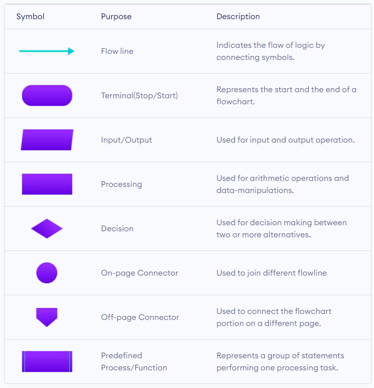
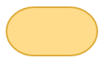
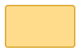
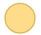
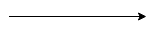

# C-Programming

## Algorithm and flowchart

### Algorithm

An algorithm is a step by step instruction written for any computational task for specific purpose. Each instruction tells what task is to be done. specification of a sequence of instruction to do a job in many fields.

Explore more:\
https://en.wikipedia.org/wiki/Algorithm

### Flowchart

The diagrammatical representation of an instruction written. in algorithm with the help of special symbols is known as flowchart. Flowchart typically shows a program's logic

Explore more:\
https://en.wikipedia.org/wiki/Flowchart

#### Flowchart symbols

Different flowchart shapes have different conventional meanings. The meanings of some of the more common shapes are as follows:

Click to expand for summary

##### Terminator

The terminator symbol represents the starting or ending point of the system.

##### Process

A box indicates some particular operation.

##### Document

This represents a printout, such as a document or a report.

##### Decision

A diamond represents a decision or branching point. Lines coming out from the diamond indicates different possible situations, leading to different sub-processes.

##### Data

It represents information entering or leaving the system. An input might be an order from a customer. Output can be a product to be delivered.

##### On-Page Reference

This symbol would contain a letter inside. It indicates that the flow continues on a matching symbol containing the same letter somewhere else on the same page.

##### Off-Page Reference

This symbol would contain a letter inside. It indicates that the flow continues on a matching symbol containing the same letter somewhere else on a different page.

##### Delay or Bottleneck

Identifies a delay or a bottleneck.

##### Flow

Lines represent the flow of the sequence and direction of a process.

[sa](./c-programming-assets/test.pdf)
