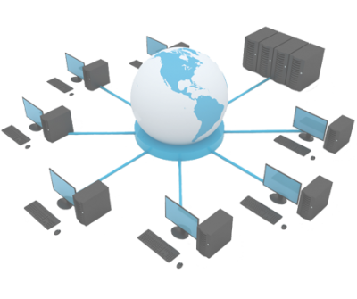
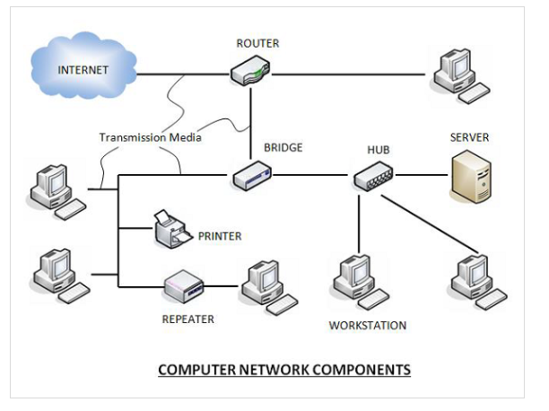

# Computer Network

A computer network is a system in which multiple computers are connected to each other to share information and resources.

## Characteristics of Computer Network

- Create files and store them in one computer, access these files from other computers connected over the network.
- Connect a printer, scanner or fax machine to one computer within the network and let other computers of the network use the machine over network.
- Share data and information to another computers.

**Computer Network Components**

Computer networks components comprise both physical parts as well as the software required for installing computer networks, both at organizations and at home. The hardware components are the server, client, peer, transmission medium, and connecting devices. The software components are operating system and protocols.

The following figure shows a network along with its components

- Hardware Components

**Servers**

Servers are high-configuration computers that manage the resources of the network. The network operating system is typically installed in the server and so they give user accesses to the network resources. Servers can be of various kinds: file servers, database servers, print servers etc.

**Clients**

Clients are computers that request and receive service from the servers to access and use the network resources.

**Peers**

Peers are computers that provide as well as receive services from other peers in a workgroup network.

**Transmission Media**

Transmission media are the channels through which data is transferred from one device to another in a network. Transmission media may be guided media like coaxial cable, fibre optic cables etc; or maybe unguided media like microwaves, infra-red waves etc.

**Connecting Devices**

Connecting devices act as middleware between networks or computers, by binding the network media together. Some of the common connecting devices are:

- Network interface card (NIC)
- Routers
- Bridges
- Hubs
- Repeaters
- Gateways
- Switches

- Software Components

**Networking Operating System**

Network Operating Systems is typically installed in the server and facilitate workstations in a network to share files, database, applications, printers etc.

**Protocol Suite**

A protocol is a rule or guideline followed by each computer for data communication. Protocol suite is a set of related protocols that are laid down for computer networks. The two popular protocol suites are

- OSI Model ( Open System Interconnections)
- TCP / IP Model

Network Interface Card(NIC)

Network interface card is a necessary component of a computer without it a computer cannot be connected over a network.

- Wired NIC card
- Wireless NIC card
