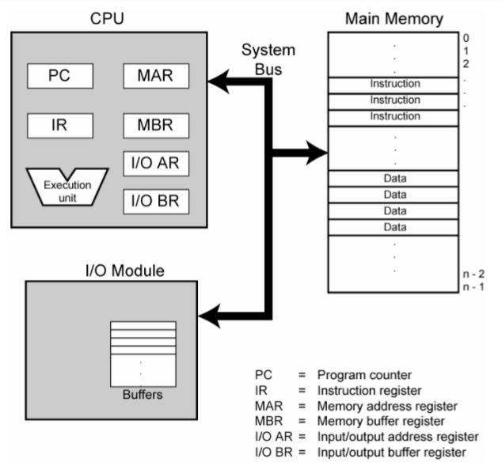

# Basic Computer Architecture

Computer organization deals with the study of how the hardware components are interconnected with each other. It is basically for the user knowledge.\
While computer architecture deals with how they work, how the data are transferred between memory and processor , processor and input/
output devices. It is for the programmer.

## Computer and its history

A **computer** is an electronic device that manipulates information, or data. It has the ability to store, retrieve, and process data. Today we use computer that are highly advance that has a got a lot of development phases that took many decades. Lets discuss the history of computer.

### Mechanical era

**Ancient times**
Early Man relied on counting on his fingers and toes (which by the way, is the basis for our base 10 numbering system). He also used sticks and stones as markers. Later notched sticks and knotted cords were used for counting.

**Abacus**
An abacus is a mechanical device that is used to calculate the arithmetic calculations quickly, also referred to as a counting frame. Its name was originated from the Latin word 'abax' or 'bacon.' Originally, it was invented thousands of years ago to perform arithmetic calculations, and today's is widely used in brain development programs. It comprises a rectangular frame that holds vertically organized rods on which beads move up and down. The main purpose of an abacus is to increase the brainpower of the children.

**1600 - Napier Bones**
John Napier, a Scottish nobleman and politician devoted much of his leisure time to the study of mathematics. He was especially interested in devising ways to aid computations. His greatest contribution was the invention of logarithms. He inscribed logarithmic measurements on a set of 10 wooden rods and thus was able to do multiplication and division by matching up numbers on the rods. These became known as Napier’s Bones.

**1621 - The Slide rule**

Napier invented logarithms, Edmund Gunter invented the logarithmic scales (lines etched on metal or wood), but it was William Oughtred, in England who invented the slide rule. Using the concept of Napier’s bones, he inscribed logarithms on strips of wood and invented the calculating "machine" which was used up until the mid-1970s when the first hand-held calculators and microcomputers appeared.

**1642 - Blaise Pascal**

Blaise Pascal, a French mathematical genius, at the age of 19 invented a machine, which he called the **_Pascaline_** that could do addition and subtraction to help his father, who was also a mathematician. Pascal’s machine consisted of a series of gears with 10 teeth each, representing the numbers 0 to 9. As each gear made one turn it would trip the next gear up to make 1/10 of a revolution. This principle remained the foundation of all mechanical adding machines for centuries after his death. The Pascal programming language was named in his honor.

**Charles Babbage**
Charles Babbage is known as the Father of the modern computer (even though none of his computers worked or were even constructed in their entirety). He first designed plans to build, what he called the Automatic Difference Engine. It was designed to help in the construction of mathematical tables for navigation. Unfortunately, engineering limitations of his time made it impossible for the computer to be built. His next project was much more ambitious.

The **analytical engine** is a machine, first proposed by Charles Babbage in 1837, that is considered to be the concept for the first general mechanical computer. The design featured an ALU(arithmetic logic unit) and permitted basic programmatic flow control. It was programmed using punch cards(inspired by the Jacquard Loom. It also featured integrated memory. For these reasons, historians consider it to be the first design concept of a general-purpose computer. Unfortunately, because of a lack of funding, the Analytical Engine was never built while Babbage was alive.

**Lady Augusta Ada Lovelace**
She was the first to recognize that the machine had applications beyond pure calculation, and to have published the first algorithm intended to be carried out by such a machine. As a result, she is often regarded as the first computer programmer. She is also the one to develop the concept of binary numbers in computer system.

**1880s – Herman Hollerith**

To overcome this problem the Census Bureau hired Dr. Herman Hollerith. In 1887, using Jacquard’s idea of the punched card data storage, Hollerith developed a punched card tabulating system, which allowed the census takers to record all the information needed on punched cards. After the census Hollerith turned to using his tabulating machines for business and in 1896 organized the Tabulating Machine Company which later merged with other companies to become IBM.

**1939-1942 Dr. John Vincent Atanasoff(1903-1995) and Clifford Berry (1918-1963)**

Dr. John Vincent Atanasoff and his graduate assistant, Clifford Barry, built the **first truly electronic computer,** called the Atanasoff-Berry Computer or ABC. Atanasoff said the idea came to him as he was sitting in a small roadside tavern in Illinois. This computer used a circuit with 45 vacuum tubes to perform the calculations, and capacitors for storage. This was also the first computer to use binary math.

### Electromechanical era

1944 – Mark I - Howard Aiken (1900-1973)**
In 1944 Dr. Howard Aiken of Harvard finished the construction of the Automatic Sequence Controlled Calculator, popularly known as the Mark I. It contained over 3000 mechanical relays and was the first electro-mechanical computer capable of making logical decisions, like**_if x==3 then do this_\*\* not like _If its raining outside I need to carry an umbrella._ The important contribution of this machine was that it was programmed by means of a punched paper tape, and the instructions could be altered. In many ways, the Mark I was the realization of Babbage’s dream.

One of the primary programmers for the Mark I was Grace Hopper. One day the Mark I was malfunctioning and not reading its paper tape input correctly. Ms Hopper checked out the reader and found a dead moth in the mechanism with its wings blocking the reading of the holes in the paper tape. She removed the moth, taped it into her log book, and recorded... Relay #70 Panel F (moth) in relay. First actual case of bug being found. She had debugged the program, and while the word bug had been used to describe defects since at least 1889, she is credited with coining the word debugging to describe the work of eliminating program errors.

**Abc**

Short for Atanasoff-Berry Computer, the ABC is considered the first electronic digital computer and was the first machine to use vacuum tubes(over 300 vacuum tubes). Professor John Vincent Atanasoff and graduate student Cliff Berry developed the ABC in 1937 and continued development until 1942 at the Iowa State College (now Iowa State University). On October 19, 1973 Judge Earl R. Larson concluded that the ENIAC, patent by Eckert and Mauchly was invalid and named Atanasoff the inventor of the first electronic digital computer.

### Electronic era

**1946 – ENIAC**

The first all electronic computer was the Electrical Numerical Integrator and Calculator, known as ENIAC. It was designed by J. Prosper Eckert and John W. Mauchly of the Moore School of Engineering at the University of Pennsylvania. ENIAC was the first multipurpose electronic computer, though very difficult to re-program. It was primarily used to computer aircraft courses, shell trajectories, and to break codes during World War II.

**1951 – UNIVAC**

The first practical electronic computer was built by Eckert and Mauchly (of ENIAC fame) and was known as UNIVAC (UNIVersal Automatic Computer). The first UNIVAC was used by the Bureau of Census. The unique feature of the UNIVAC was that it was not a one-of-a-kind computer. It was mass produced.

## Memory units

**Just how much data is that**

```
8 bits = 1 byte
1024 bytes = 1 kilobyte
1024 K = 1 Megabyte = 1,048,576 bytes
1024 Mb = 1 Gigabyte = 10,73,741,824 bytes
1024 Gb = 1 Terabyte = 1,099,511,627,776 bytes
1024 Tb = 1 Petabyte = 1,125,899,906,842,624 bytes
1024 Pb = 1 Exabyte = 1,152,921,504,606,846,976 bytes
1024 Eb = 1 Zettabyte = 1,180,591,620,717,411,303,424 bytes
1024 Zb = 1 Yottabyte = 1,208,925,819,614,629,174,706,176 bytes
```

## Data and information

- Data is a collection of facts. Information is how you understand those facts in context.
- Data is unorganized, while information is structured or organized.
- Data is not typically useful on its own, but information is.
- Data generally includes the raw forms of numbers, statements, and characters. Information doesn’t have to.
- Information depends on data.\
  In the world of computers, data is the _input_ , or what you tell the computer to do or save. Information is the _output_ , or how the computer interprets your data and shows you the requested action

## Structure of computer top view

- Computer components
- Data and instructions are stored in single read – write memory.
- The contents of this memory are addressable by location, without regard to the type of
  data contained there.
- Execution occurs in a sequential fashion from one instruction to the next.
- If there is a particular computation to be performed, a configuration of logic
  components designed specially for that computation could be constructed.
- Programming in hardware


_fog: Hardware and software approach_



_Fig: Computer components, top level view_

### Computer Function


_Fig: Basic instruction cycle_

**Fetch cycle**

At the beginning of each instruction cycle, the processor fetches an instruction from memory. In a typical processor, a register called the program counter (PC) holds the address of the instruction to be fetched next. Unless told otherwise, the processor always increments the PC after each instruction fetch so that it will fetch the next instruction in sequence. The fetched instruction is loaded into a register in the processor known as the instruction register (IR). The instruction contains bits that specify the action the processor is to take. The processor interprets the instruction and performs the re quired action.

**Execute Cycle**

In general, the required actions fall into four categories:
Processor-memory: Data may be transferred from processor to memory or from memory
to processor.
Processor-I/O: Data may be transferred to or from a peripheral device by transferring
between the processor and an I/O module.
Data processing: The processor may perform some arithmetic or logic opera tion on data.
Control: An instruction may specify that the sequence of execution be altered.
An instruction’s execution may involve a combination of these actions.

### Central processing unit


_Fig: Central Processing Unit (CPU)_

**The central processing unit (CPU) consists of six main components**

- control unit (CU)
- arithmetic logic unit (ALU)
- registers
- cache
- buses
- clock

**Components of a Control Unit**

The components of this unit are instruction registers, control signals within the CPU, control signals to/from the bus, control bus, input flags, and clock signals.


_Fig: Control Unit_

**Instruction register**


_Fig: Instruction Register_

Types of instruction : read , write, addition , subtraction, load, BUN

**Flags**
A flag is one or more data bits used to store binary values as specific program structure indicators. The **Flag register** is a Special Purpose Register. Depending upon the value of result after any arithmetic and logical operation the flag bits become set (1) or reset (0). In 8085 microprocessor, flag register consists of 8 bits and only 5 of them are useful.


_Fig: Flags_

**Sign Flag (S)**

After any operation if the MSB (B(7)) of the result is 1, it indicates the number is negative and the sign flag becomes set, i.e. 1. If the MSB is 0, it indicates the number is positive and the sign flag becomes reset i.e. 0.

**Zero Flag (Z)**

After any arithmetic or logical operation if the result is 0 (00)H, the zero flag becomes set i.e. 1, otherwise it becomes reset i.e. 0. 00H zero flag is 1.

**Auxiliary Carry Flag (AC)**

This flag is used in BCD number system(0-9). If after any arithmetic or logical operation D(3) generates any carry and passes on to B(4) this flag becomes set i.e. 1, otherwise it becomes reset i.e. 0. This is the only flag register which is not accessible by the programmer.

**Parity Flag (P)**

If after any arithmetic or logical operation the result has even parity, an even number of 1 bits, the parity register becomes set i.e. 1, otherwise it becomes reset i.e. 0.

**Carry Flag (CY)**

Carry is generated when performing n bit operations and the result is more than n bits, then this flag becomes set i.e. 1, otherwise it becomes reset i.e. 0. During subtraction (A-B), if A>B it becomes reset and if (A<B) it becomes set.

**Historically there have been 2 types of Computers:**

**Fixed Program Computers**

Their function is very specific and they couldn’t be programmed, e.g. Calculators.

**Stored Program Computers**

These can be programmed to carry out many different tasks, applications are stored on them, hence the name. Stored-program concept is designed by Hungarian mathematician John Von Neumann.

**ENIAC (Electronic Numerical Integrator and Computer)** was the first computing system designed in the early 1940s. It was based on Stored Program Concept in which machine use memory for processing data. ENIAC had a ‘control board ‘ on which program were wired. A rewiring of the control board was necessary for each computation sequencing. John von neumann a member of Eckert – Mauchly team (developer of ENIAC), developed EDVAC, the fix stored program.
The von Neumann architecture is a design model for a stored-program digital computer that uses a processing unit and a single separate storage structure to hold both instructions and data.

**Design of the von Neumann architecture**\
A von Neumann Architecture computer has five parts: an arithmetic-logic unit , a control unit , a memory , some form of input/output and a system bus that provides a data path between these parts. The modern computers are based on a stored-program concept introduced by John Von Neumann. In this stored-program concept, programs and data are stored in a separate storage unit called memories and are treated the same. This novel idea meant that a computer built with this architecture would be much easier to reprogram.


_Fig: Von neumann Architecture_

It is also known as **IAS** computer and is having three basic units:

- The Central Processing Unit (CPU)
- The Main Memory Unit
- The Input/Output Device

Let’s consider them in details.

**Control Unit**

A control unit (CU) handles all processor control signals. It directs all input and output flow, fetches code for instructions, and controls how data moves around the system.

**Arithmetic and Logic Unit (ALU)**

The arithmetic logic unit is that part of the CPU that handles all the calculations the CPU may need, e.g. Addition, Subtraction, Comparisons. It performs Logical Operations, Bit Shifting Operations, and Arithmetic operations.

**Input/Output Devices**

Program or data is read into main memory from the _input device_ or secondary storage under the control of CPU input instruction. _Output devices_ are used to output the information from a computer. If some results are evaluated
by computer and it is stored in the computer, then with the help of output devices, we can present them to the user.

**Buses**

Data is transmitted from one part of a computer to another, connecting all major internal components to the CPU and memory, by the means of Buses. Types:

**Data Bus:**

It carries data among the memory unit, the I/O devices, and the processor.

**Address Bus:**

It carries the address of data (not the actual data) between memory and
processor.

**Control Bus:**

It carries control commands from the CPU (and status signals from other devices) in order to control and coordinate all the activities within the computer.

**Von Neumann bottleneck**

Whatever we do to enhance performance, we cannot get away from the fact that instructions can only be done one at a time and can only be carried out sequentially. Both of these factors hold back the competence of the CPU. This is commonly referred to as the ‘Von Neumann bottleneck’. We can provide a Von Neumann processor with more cache, more RAM, or faster components but if original gains are to be made in CPU performance then an influential inspection needs to take place of CPU configuration. This architecture is very important and is used in our PCs and even in Super Computers.

**Harvard Architecture**

In a normal computer that follows von Neumann architecture, instructions and data both are stored in the same memory. So same buses are used to fetch instructions and data. This means the CPU cannot do both things together (read the instruction and read/write data). **Harvard Architecture** is the computer architecture that contains separate storage and separate buses (signal path) for instruction and data. It was basically developed to overcome the bottleneck of Von Neumann Architecture. The main advantage of having separate buses for instruction and data is that the CPU can access instructions and read/write data at the same time.


_Fig: Harvard Architecture_

**Buses**

Buses are used as signal pathways. In Harvard architecture, there are separate buses for both instruction and data.

**Types of Buses:**

**Data Bus:**

It carries data among the main memory system, processor, and I/O devices.

**Data Address Bus:**

It carries the address of data from the processor to the main memory system.

**Instruction Bus:**

It carries instructions among the main memory system, processor, and I/O
devices.

**Instruction Address Bus:**

It carries the address of instructions from the processor to the main
memory system.

**Operational Registers**

There are different types of registers involved in it which are used for storing addresses of different types of instructions. _For example_ , the Memory Address Register and Memory Data Register are operational registers.

**Program Counter**

It has the location of the next instruction to be executed. The program counter then passes this next address to the memory address register.

**Arithmetic and Logic Unit**

The arithmetic logic unit is that part of the CPU that operates all the calculations needed. It performs addition, subtraction, comparison, logical Operations, bit Shifting Operations, and various arithmetic operations.

**Control Unit**

The Control Unit is the part of the CPU that operates all processor control signals. It controls the input and output devices and also controls the movement of instructions and data within the system.

**Input/Output System**

Input devices are used to read data into main memory with the help of CPU input instruction. The information from a computer as output is given through Output devices. The computer gives the results of computation with the help of output devices.

**Advantage of Harvard Architecture**

Harvard architecture has two separate buses for instruction and data. Hence, the CPU can access instructions and read/write data at the same time. This is the major advantage of Harvard architecture. In practice, Modified Harvard Architecture is used where we have two separate caches (data and instruction). This is common and used in X86 and ARM processors.

| VON NEUMANN ARCHITECTURE                                                      | HARVARD ARCHITECTURE                                                          |
| ----------------------------------------------------------------------------- | ----------------------------------------------------------------------------- |
| It is ancient computer architecture based on stored program computer concept. | It is modern computer architecture based on Harvard Mark I relay based model. |
| Same physical memory address is used for instructions and data.               | Separate physical memory address is used for instructions and data.           |
| There is common bus for data and instruction transfer.                        | Separate buses are used for transferring data and instruction.                |
| Two clock cycles are required to execute single instruction.                  | An instruction is executed in a single cycle.                                 |
| It is cheaper in cost.                                                        | It is costly than Von Neumann Architecture.                                   |
| CPU can not access instructions and read/write at the same time.              | CPU can access instructions and read/write at the same time.                  |
| It is used in personal computers and small computers.                         | It is used in micro controllers and signal processing.                        |

### Number System and Base Conversion

A number is a mathematical value used for counting and measuring objects, and for performing arithmetic calculations. Numbers have various categories like natural numbers, whole numbers, rational and irrational numbers, and so on. Similarly, there are various types of number systems that have different properties, like the binary number system, the octal number system, the decimal number system, and the hexadecimal number system.

Number System is a method of representing Numbers on the Number Line with the help of a set of Symbols and rules. Electronic and Digital systems may use a variety of different number systems, (e.g. Decimal, Hexadecimal, Octal, Binary).

**Binary Number System (Base 2)**

A computer can understand only the “on” and “off” state of a switch. These two states are represented by 1 and 0. The combination of 1 and 0 form binary numbers. These numbers represent various data. As two digits are used to represent numbers, it is called a binary or base 2 number system. The binary number system uses positional notation. Ex.(101101) 2

**Octal Number System (Base 8)**

This system uses digits 0 to 7 (i.e. 8 digits) to represent a number and the numbers are as a base of 8. For example, (24) 8

**Decimal Number System (Base 10)**

In this number system, the digits 0 to 9 represents numbers. As it uses 10 digits to represent a number, it is also called the base 10 number system. Each digit has a value based on its position called place value. The value of the position increases by 10 times as we move from right to left in the number. for eg. 141 10

**Hexadecimal Number System (Base 16)**

In this system, 16 digits used to represent a given number. Thus it is also known as the base 16 number system. Each digit position represents a power of 16. As the base is greater than 10, the number system is supplemented by letters. Following are the hexadecimal symbols: 0, 1, 2, 3, 4, 5, 6, 7, 8, 9, A, B, C, D, E, F eg. (1056) 16

**Binary to Decimal Conversion**

```
(10110.001) 2
(10110.001) 2** =(1×2^4 )+(0×2^3 )+(1×2^2 )+(1×2^1 )+(0×2^0 )+ (0×2-1)+(0×2-2)+(1×2-3)
**=** (1×16)+(0×8)+(1×4)+(1×2)+(0×1)+ (0×1⁄2)+(0×1⁄4)+(1×1⁄8)
=16+0+4+2+0+0+0+0.125
**(10110.001) 2** = **(22.125 ) 10
```

**Binary to Octal Conversion**

```
(111110101011.0011) 2**
Firstly, we make pairs of three bits on both sides of the binary point.
111 110 101 011.001 1
On the right side of the binary point, the last pair has only one bit. To make it a complete pair
of three bits, we added two zeros on the extreme side.
111 110 101 011.001 100
Then, we wrote the octal digits, which correspond to each pair.
**(111110101011.0011) 2 =(7653.14) 8
```

**Binary to Hexadecimal Conversion (10110101011.0011) 2**

```
Firstly, we make pairs of four bits on both sides of the binary point.
111 1010 1011.0011
Then, we write the hexadecimal digits, which correspond to each pair.
**(011110101011.0011) 2 =(7AB.3) 16**
```

**Hexadecimal to binary**

```
DB5 16
Convert each hexadecimal number into binary number. 1 hex number = 4 bit binary number
1101 1011 0101 2

**(152A.25) 16**
We write the four-bit binary digit for 1, 5, 2, A, and 5.

**- (152A.25) 16 =(0001 0101 0010 1010.0010 0101) 2**
```

**Hexadecimal to Octal Conversion**

```
(152A.25) 16**
Then, we make pairs of three bits on both sides of the binary point.
001 010 100 101 010.001 001 010
Then, we write the octal digit, which corresponds to each pair.
**(001010100101010.001001010) 2 =(12452.112) 8**
```

**Hexadecimal to decimal**

```
Convert the number **35432** HEXADECIMAL to DECIMAL
**2x(16^0) + 3x(16^1) + 4x(16^2) + 5x(16^3) + 3x(16^4)
=2 + 3x16 + 4_256 + 5_4096 + 3\*65536
=2 + 48 + 1024 + 20480 + 196608
= 218162**
```
