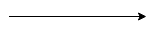
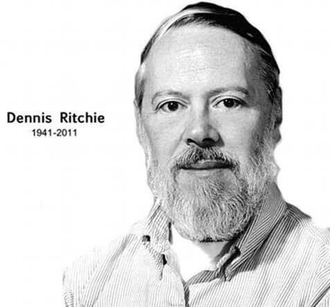
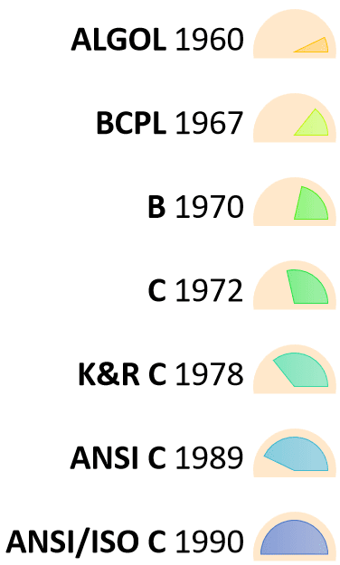

# C-Programming

## Problem Solving in Computer

Computer based problem solving is a systematic process of designing, implementing and using programming tools during the problem solving stage. This method enables the computer system to be more intuitive with human logic than machine logic. Final outcome of this process is software tools which is dedicated to solve the problem under consideration. Software is just a collection of computer programs and programs are a set of instructions which guides computer’s hardware. These instructions need to be well specified for solving the problem. After its creation, the software should be error free and well documented. Software development is the process of creating such software, which satisfies end user’s requirements and needs.

**The following six steps must be followed to solve a problem using computer.**

- [Problem Analysis](https://www.codesansar.com/computer-basics/problem-analysis.htm)
- [Program Design - Algorithm, Flowchart and Pseudocode](https://www.codesansar.com/computer-basics/program-design.htm)
- [Coding](https://www.codesansar.com/computer-basics/coding.htm)
- [Compilation and Execution](https://www.codesansar.com/computer-basics/compilation-and-execution.htm)
- [Debugging and Testing](https://www.codesansar.com/computer-basics/debugging-and-testing.htm)
- [Program Documentation](https://www.codesansar.com/computer-basics/program-documentation.htm)

### Problem Analysis

Problem analysis is the process of defining a problem and decomposing
overall system into smaller parts to identify possible inputs, processes and
outputs associated with the problem. This task is further subdivided into six
subtasks namely:

1. Specifying the Objectives: First, we need to know what problem is actually being solved. Making a clear statement of the problem depends upon the size and complexity of the problem.
2. Specifying the Output: Before identifying inputs required for the system, we need to identify what comes out of the system. The best way to specify output is to prepare some output forms and required format for displaying
   result.
3. Specifying Input requirement: After having specified the outputs, the input and data required for the system need to be specified as well. One needs to identify the list of inputs required and the source of data. For example, in a simple program to keep student’s record, the inputs could be the student’s name, address, roll-numbers, etc.
4. Specifying Processing Requirements: When output and inputs are specified, we need to specify process that converts specified inputs into desired output. If the proposed program is to replace or supplement an existing one, a careful evaluation of the present processing procedures needs to be made, noting any improvements that could made. If the proposed system is not designed to replace an existing system, then it is well advised to carefully evaluate another system that addresses a similar problem.
5. Evaluating the feasibility: After the successful completion of all the above four steps one needs to see whether the things accomplished so far in the process of problem solving are practical and feasible. To replace an system one needs to determine how the potential improvements outperforms existing system or other similar system.
6. Problem Analysis and documentation: Before concluding the program analysis stage, it is best to record whatever has been done so far in the first phase of program development. The record should contain the statement of program
   objectives, output and input specifications, processing requirements and feasibility.

### Program Design

The second stage in software development or problem solving using computer cycle
is program design. This stage consists of preparing algorithms, flowcharts and
pseudocodes. Generally, this stage intends to make the program more user friendly,
feasible and optimized. Programmer just requires a pen and pencil in this step in
which the tasks are first converted into a structured layout without the involvement
of computer. In structured programming, a given task is divided into number of
sub-tasks which are termed as modules. Each process is further divided until no
further divisions are required. This process of dividing a program into modules and
then into sub-modules is known as “top down” design approach. Dividing a program
into modules (functions) breaks down a given programming task into small,
independent and manageable tasks.

In program design we are mainly interested in designing:

#### Algorithm

An algorithm is a step by step instruction written for any computational task for specific purpose. Each instruction tells what task is to be done. specification of a sequence of instruction to do a job in many fields.

Explore more:\
https://en.wikipedia.org/wiki/Algorithm

#### Flowchart

The diagrammatical representation of an instruction written. in algorithm with the help of special symbols is known as flowchart. Flowchart typically shows a program's logic

Explore more:\
https://en.wikipedia.org/wiki/Flowchart

##### Flowchart symbols

Different flowchart shapes have different conventional meanings. The meanings of some of the more common shapes are as follows:

<details><summary>Click to expand for summary</summary>


</details>

###### Terminator

The terminator symbol represents the starting or ending point of the system.


###### Process

A box indicates some particular operation.


###### Document

This represents a printout, such as a document or a report.


###### Decision

A diamond represents a decision or branching point. Lines coming out from the diamond indicates different possible situations, leading to different sub-processes.


###### Data

It represents information entering or leaving the system. An input might be an order from a customer. Output can be a product to be delivered.


###### On-Page Reference

This symbol would contain a letter inside. It indicates that the flow continues on a matching symbol containing the same letter somewhere else on the same page.


###### Off-Page Reference

This symbol would contain a letter inside. It indicates that the flow continues on a matching symbol containing the same letter somewhere else on a different page.


###### Delay or Bottleneck

Identifies a delay or a bottleneck.


###### Flow

Lines represent the flow of the sequence and direction of a process.



- Pseudocode

### Coding (Programming)

In this stage, process of writing actual program takes place. A coded program is most popularly referred to as a source code. The coding process can be done in any language (high level and low level). The actual use of computer takes place in this stage in which the programmer writes a sequence of instructions ready for execution. Coding is also known as programming.

**Good program possess following characteristics**

1. Comment clauses in the program help to make the program readable and understandable by people other than the original programmer.
2. It should be efficient.
3. It must be reliable enough to work under all reasonable conditions to provide a correct output.
4. It must be able to detect unreasonable error conditions and report them to the end user or programmer without crashing the system.
5. It should be easy to maintain and support after installation.

### Compilation and Execution Process

Generally coding is done in high level language or low level language (assembly language). For the computer to understand these languages, they must be translated into machine level language. The translation process is carried out by a compiler/interpreter (for high level language) or an assembler (for assembly language program). The machine language code thus created can be saved and run immediately or later on.

In an interpreted program, each program statement is converted into machine code before program is executed. The execution occurs immediately one statement at a time sequentially. BASIC is one of the frequently used interpreted language. In contrast to interpreter, a compiler converts a given source code into object code. Once an object code is obtained, the compiled programs can be faster and more efficient than interpreted programs.

### Debugging and Testing

- Error

Error means failure of compilation and execution of the computer program or not getting expected results after execution. Debugging and testing are systematic process during program development cycle to avoid errors in the program. Different types of error that we encounter while programming are listed below

**Types of Error:**

**Syntax Error :** Syntax error is a violation of programming rules while writing it. A syntax error does not allow the code to run. Syntax error can be easily detected during the compilation process using compiler.

**Logical Error :** Logical error occurs when a programmer has applied incorrect logic for solving problem or left out a programming procedure. When logical error occurs program executes but fails to produce a correct result.

**Run Time Error :** Run time error occurs during the execution of program. Stack overflow, divide by zero, floating point error etc. are examples of runtime error.

**Debugging**

Debugging is the process of finding errors and removing them from a computer program, otherwise they will lead to failure of the program. Even after taking full care during program design and coding, some errors may remain in the program and these errors appear during compilation or linking or execution. Debugging is generally done by program developer.

**Testing**

Testing is performed to verify that whether the completed software package functions or works according to the expectations defined by the requirements. Testing is generally performed by testing team which repetitively executes program with intent to find error. After testing, list of errors and related information is sent to program developer or development team.

### Program Documentation

The program documentation is the process of collecting information about the program. The documentation process starts from the problem analysis phase to debugging and testing. Documentation consists two types of documentation, they are:

- Programmer's Documentation
- User's Documentation

**Programmer's Documentation**

Programmer’s documentation contains all the technical details. Without proper documentation it is very difficult even for the original programmer to update and maintain the program. A programmer’s documentation contains the necessary information that a programmer requires to update and maintain the program.

These information includes:

- Program analysis document, with a concise statement of program’s objectives, outputs and processing procedures.
- Program design documents with appropriate flowcharts and diagrams.
- Program verification documents for outlining, checking, testing and correction procedures along with the list of sample data and results.
- Log used to document future program revision and maintenance activity.

**User's Documentation**

User documentation is required for the end user who installs and uses the program. It consists instructions for installation of the program and user manual.

## History of C

The base or father of programming languages is ‘ALGOL.’ It was first introduced in 1960. ‘ALGOL’ was used on a large basis in European countries. ‘ALGOL’ introduced the concept of structured programming to the developer community. In 1967, a new computer programming language was announced called as ‘BCPL’ which stands for Basic Combined Programming Language. BCPL was designed and developed by Martin Richards, especially for writing system software. This was the era of programming languages. Just after three years, in 1970 a new programming language called ‘B’ was introduced by Ken Thompson that contained multiple features of ‘BCPL.’ This programming language was created using UNIX operating system at AT&T and Bell Laboratories. Both the ‘BCPL’ and ‘B’ were system programming languages.



In 1972, a great computer scientist Dennis Ritchie created a new programming language called ‘C’ at the Bell Laboratories. It was created from ‘ALGOL’, ‘BCPL’ and ‘B’ programming languages. ‘C’ programming language contains all the features of these languages and many more additional concepts that make it unique from other languages.

‘C’ is a powerful programming language which is strongly associated with the UNIX operating system. Even most of the UNIX operating system is coded in ‘C’. Initially ‘C’ programming was limited to the UNIX operating system, but as it started spreading around the world, it became commercial, and many compilers were released for cross-platform systems. Today ‘C’ runs under a variety of operating systems and hardware platforms. As it started evolving many different versions of the language were released. At times it became difficult for the developers to keep up with the latest version as the systems were running under the older versions. To assure that ‘C’ language will remain standard, American National Standards Institute (ANSI) defined a commercial standard for ‘C’ language in 1989. Later, it was approved by the International Standards Organization (ISO) in 1990. ‘C’ programming language is also called as ‘ANSI C’.



Languages such as C++/Java are developed from ‘C’. These languages are widely used in various technologies. Thus, ‘C’ forms a base for many other languages that are currently in use.

**Different section of C programs**

- Documentation Section
  Documentation section is generally description of program. Documentation section of c programming consists program's name, program's objective, author name and creation date etc.

Example

```c
/* This program calculates area of circle
Author: Ramesh Bhandari
Date: November 27, 2017
*/
```

- Header File Section
  This section includes all necessary header files which are required for the working of different function in program.

Example

```c
#include<stdio.h>
#include<conio.h>
#include<stdlib.h>
```

- Definition Section
  This section is used to define symbolic constants. Generally capital letter is used to define symbolic constants.

Example

```c
#define PI 3.141592
#define SIZE 10
#define GOLDENRATIO 1.618

// Here PI, SIZE and GOLDENRATIO are symbolic constants
```

- Global Variable and Function Prototype Section
  This section is used to declare global variables. Global variables are generally used in more than one function. Similarly all prototypes of sub-program (user defined functions) are declared in this section.

```c
/* Global Variables */
int a;
float b;
char c;
/* End of Global Variables */
/* Function Prototype Section */
int sum(int x, int y);
void message( void );
/* End of Function Prototype Section */
```

- Main Function Section
  Every C program must have main() function. It consists two parts, namely, local variable declaration section and executable statement section, and these two parts must be in between opening and closing braces.

- Local Variable Declaration Section
  This section is used for declaring local variables which are to be used in executable statement part.

Example

```c
int x;
float y;
char z;
```

- Executable Statement Section
  Executable statement section consists all the instructions to be executed. The program execution starts from opening brace of `main()` function and ends at closing brace of `main()` function. The closing brace of `main()` function is logical end of program.

- Sub Program Section
  This section consists definition of all user defined function that are declared in function prototype section.
