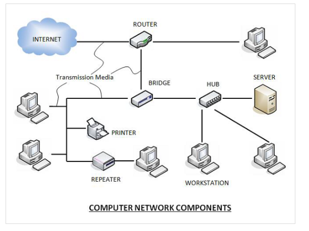
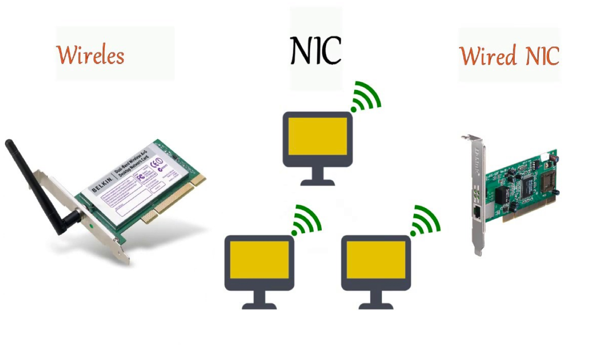
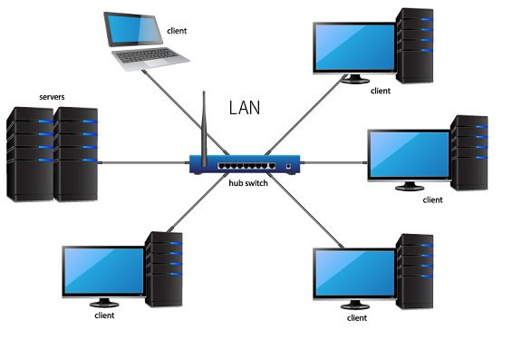
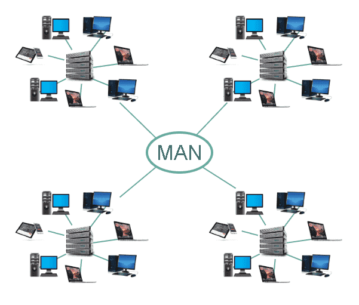
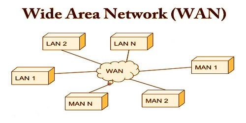

# Computer Network

A computer network is a system in which multiple computers are connected to each other to share information and resources.

## Characteristics

- Create files and store them in one computer, access these files from other computers connected over the network.
- Connect a printer, scanner or fax machine to one computer within the network and let other computers of the network use the machine over network.
- Share data and information to another computers.

**Computer Network Components**

Computer networks components comprise both physical parts as well as the software required for installing computer networks, both at organizations and at home. The hardware components are the server, client, peer, transmission medium, and connecting devices. The software components are operating system and protocols.

The following figure shows a network along with its components

**Hardware Components**

**Servers**

Servers are high-configuration computers that manage the resources of the network. The network operating system is typically installed in the server and so they give user accesses to the network resources. Servers can be of various kinds: file servers, database servers, print servers etc.

**Clients**

Clients are computers that request and receive service from the servers to access and use the network resources.

**Peers**

Peers are computers that provide as well as receive services from other peers in a workgroup network.

**Transmission Media**

Transmission media are the channels through which data is transferred from one device to another in a network. Transmission media may be guided media like coaxial cable, fibre optic cables etc; or maybe unguided media like microwaves, infra-red waves etc.

**Connecting Devices**

Connecting devices act as middleware between networks or computers, by binding the network media together. Some of the common connecting devices are:

- Network interface card (NIC)
- Routers
- Bridges
- Hubs
- Repeaters
- Gateways
- Switches

- Software Components

**Networking Operating System**

Network Operating Systems is typically installed in the server and facilitate workstations in a network to share files, database, applications, printers etc.

**Protocol Suite**

A protocol is a rule or guideline followed by each computer for data communication. Protocol suite is a set of related protocols that are laid down for computer networks. The two popular protocol suites are

- OSI Model ( Open System Interconnections)
- TCP / IP Model

Network Interface Card(NIC)

Network interface card is a necessary component of a computer without it a computer cannot be connected over a network.

- Wired NIC card
- Wireless NIC card

Network Representations

Network architects and administrators must be able to show what their networks will look like. They need to be able to easily see which components connect to other components, where they will be located, and how they will be connected. Diagrams of networks often use symbols, like those shown in the figure, to represent the different devices and connections that make up a network.

A diagram provides an easy way to understand how devices connect in a large network. This type of “picture” of a network is known as a topology diagram. The ability to recognize the logical representations of the physical networking components is critical to being able to visualize the organization and operation of a network.

In addition to these representations, specialized terminology is used to describe how each of these devices and media connect to each other:

- Network Interface Card (NIC) – A NIC physically connects the end device to the network.
- Physical Port – A connector or outlet on a networking device where the media connects to an end device or another networking device.
- Interface – Specialized ports on a networking device that connect to individual networks. Because routers connect networks, the ports on a router are referred to as network interfaces.

Types of Computer Networks

A computer network is a cluster of computers over a shared communication path that works for the purpose of sharing resources from one computer to another, provided by or located on the network nodes.

Some of the uses of computer networks are the following

- Communicating using email, video, instant messaging, etc.
- Sharing devices such as printers, scanners, etc.
- Sharing files
- Sharing software and operating programs on remote systems
- Allowing network users to easily access and maintain information

Types of Computer Networks

- Personal Area Network (PAN)

A personal area network (PAN) is a computer network for interconnecting electronic devices within an individual person's workspace.[1] A PAN provides data transmission among devices such as computers, smartphones, tablets and personal digital assistants. Pans can be used for communication among the personal devices themselves, or for connecting to a higher level network and the internet where one master device takes up the role as gateway.
A pan may be wireless or carried over wired interfaces such as usb. A wireless personal area network (WPAN) is a PAN carried over a low-powered, short-distance wireless network technology such as irda, wireless USB, Bluetooth. The reach of a WPAN varies from a few centimeters to a few meters.

- Local Area Network (LAN)

- It is the computer network within a very limited area and connected in a way that enables them to communicate with one another
- Usually, LAN covers an organization’ offices, schools, colleges or universities
- LAN is set up to when team members need to share software and hardware resources with each other but not with the outside world.
- LAN provides a useful way of sharing the resources between end users. The resources such as printers, file servers, scanners, and internet are easily sharable among computers

Features

- It covers small geographical area.
- It mostly uses guided Transmission Media
- All the components share common protocol
- Communication cost is low
- Speed is 1 mbps to several 100 mbps
- It is private network so, ownership is single organization
- No special security is

Advantages

- Data transmission speed is faster than MAN and WAN
- It has higher security to resources of the network
- It is cheaper to establish.
- It is easier to establish, manage, and operate

Disadvantages of LAN

- It is limited only to a small area
- It connects comparatively less number of computers
- LAN can only connect a number of computers that are in a particular area such as a school, in a building, and is a space that is often associated with a pc computer

- Campus Area Network (CAN)

A campus area network (CAN) is a computer network that spans a limited geographic area. CANs interconnect multiple local area networks (LAN) within an educational or corporate campus. Most CANs connect to the public Internet.
CANs are smaller than metropolitan area networks (MAN) and wide area networks (WAN), which stretch over large geographic areas. Typically, the organization that owns the campus also owns and operates all the networking equipment and infrastructure for the CAN. In contrast, MANs and WANs may combine infrastructure operated by several different providers.

- Metropolitan Area Network (MAN)

MAN Stands for Metropolitan Area Network

- A Network intermediate between a local area network(LAN) and Wide area Network(WAN).
- MAN is Extended up to a city or a larger geographical Area than LAN.
- A MAN Connects several LANS.
- It can use either wired and Wireless Transmission Media.
- This network mostly uses bridges, repeaters, routers, Switches
- MAN is larger than a LAN and typically spread over several kilometers.
- Objective of MAN is to share hardware and software resources, thereby decreasing infrastructure costs. MAN can be built by connecting several LANs.

Features

- It covered large geographical Area
- It is made up of combination of two or more than two LANs
- It is mainly used fiber optic cables
- It generally covers city or a town
- It supports voice communication
- It may be used in guided (Wired) or Unguided (Wireless ) medium

Advantages of MAN

- It is Spread to a larger area than LAN
- It connects comparatively more numbers of computers than LAN
- It can connects dissimilar systems and network
- Public libraries and government agencies typically uses a MAN

Disadvantages

- It uses comparatively expensive devices than used in LAN.
- Transmission speed is usually slower compared to LAN.
- It is complex to establish, manage and provide security.
- It is expensive to run than LAN. More cable requirement for MAN connection from one place to another

- Wide Area Network (WAN)

- As the name suggests, the Wide Area Network (WAN) covers a wide area which may span across provinces and even a whole country.
- WAN is typically a network of many LANs, MANs and WANs. Network is set up using wired or wireless connections, depending on availability and reliability.
- The most common example of WAN is the Internet.
- Communication is usually done through satellite, microwave system or optical fibers.
- It uses devices like routers, gateways, switches etc. These devices are much more expensive than used in LAN

Features

- It can support large geographical Area
- Wireless media ,especially communication satellite is used
- Different types of protocol can be used
- Communication cost is high
- Special Security is needed
- WAN is a computer network that covers a broad area

Advantages

- It spread to large area than LAN and MAN
- It connects comparatively more number of computers than LAN and MAN
- It also connects dissimilar systems and networks
- WAN network Seeks to connect places in Kathmandu with other places in the world as Tokyo or Moscow in just minutes, without the need to afford a big sum of money for a pay phone

Disadvantages

- It uses comparatively expensive devices than used in LAN and MAN
- Transmission speed is usually slower compare to LAN and MAN
- It is complex to establish ,manage and provide security
- High qualified technical personnel and government agencies are worked together to establish this type of network. Thus invest money and effort is top

Q. Write 5 Difference between LAN, MAN & WAN.
