# Internet Fundamental and Applications

:::tip See also

[Internet Fundamentals at Glance (Click to read)](internet-fundamentals-assets/1.pdf)

:::

## Introduction

### Internet and it's history

- In mid 60's ARPA in DOD was interested in finding a way to connect computers together just so, that researchers they funded could share their findings, thereby reducing costs and eliminating duplication of effort.
- In 1969 Four nodes at university of california at los angeles , university of california, stanford research institute and university of utah were connected.
- Arpa connected multiple other universities by the end but still it was not called internet, it was still a network.
- In 1972, Vint cerf and Bob Kahn both of whom were part of core ARPANET group collaborated in what they called Internetting project,
- They wanted to link different networks together so that one host network could communicate with second host in different network.
- They developed a gateway to connected multiple network. TCP IP was also introduced which became standard protocol to share data over internet.
- In 1981 CSNET was introduced by NSF. Only those who were tied up with DOD used Arpanet , CSNET allowed other universities to use internet.
- In 1983 ARPANET Splits to MILNET AND ARPANET.
- IN 1986 NSFNET was introduced as a successor of CSNET that connected 5 supercomputers centers located throughout US with speed of 1.544 Mbps.
- In 1990 ARPANET was dismantled because it was slow to use.
- In 1991 ANSNET was introduced by 3 different companies like IBM, Merit and MCI came together to form ANSNET as NSFNET was slow. ANSNET became commercial and many companies started using it.

:::tip See also

[History of the Internet (Wikipedia)](https://en.wikipedia.org/wiki/History_of_the_Internet)

:::

### Network and Internet

- Network is simply just connecting computers to share resources.
- The global networks of network is called internet.

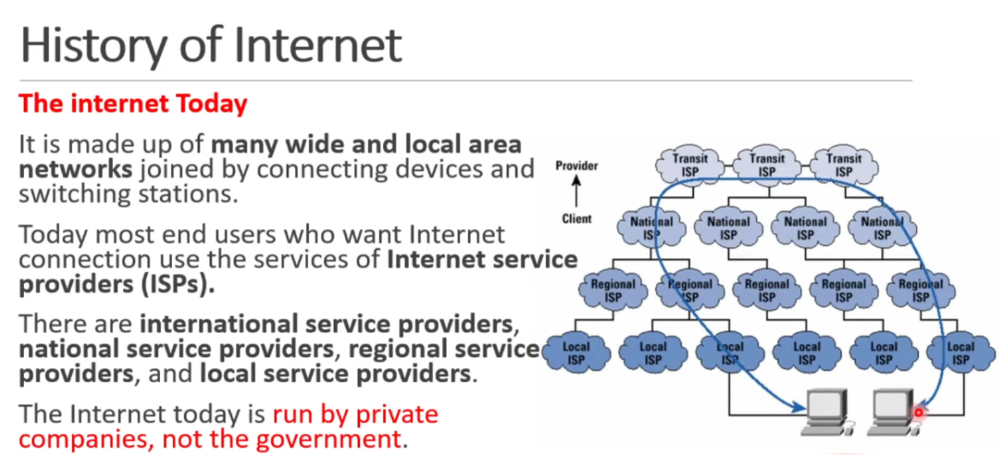

### How does internet work?

:::tip See also

[How does internet work (MDN)](https://developer.mozilla.org/en-US/docs/Learn/Common_questions/How_does_the_Internet_work)

:::

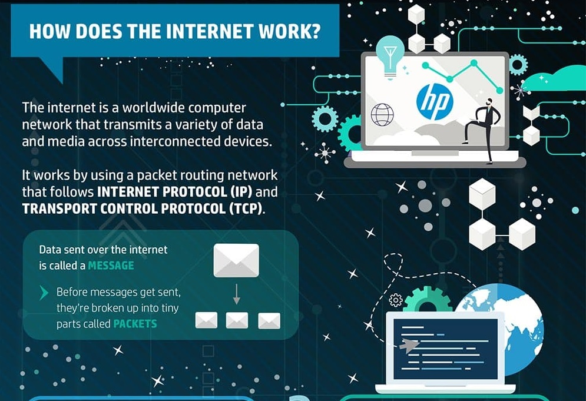

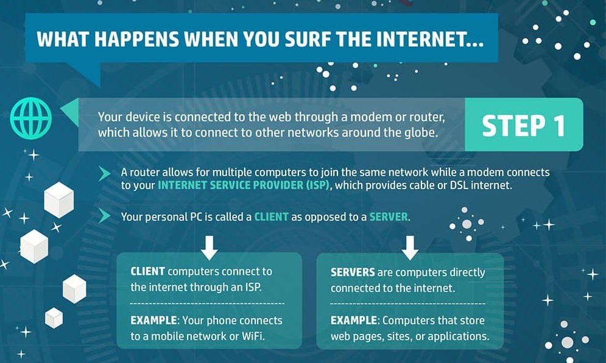
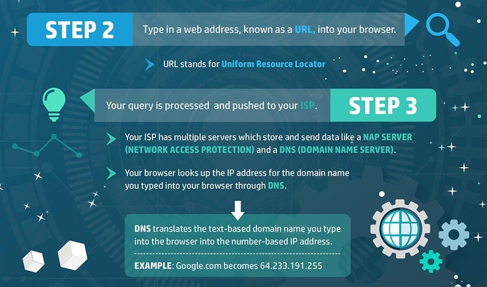

### Internet, Intranet and Extranet

**Internet**

The network formed by the co-operative interconnection of millions of computers, linked together is called Internet. Internet comprises of :

- People : People use and develop the network.
- Resources : A collection of resources that can be reached from those networks.
- A setup for collaboration : It includes the member of the research and educational committees worldwide.

**Intranet**

It is an internal private network built within an organization using Internet and World Wide Web standards and products that allows employees of an organization to gain access to corporate information. The main purpose of intranet is to share company information and computing resources among employees. Firewall is used to prohibit external users. Only authenticated users are allow to use the internet.

**Extranet**

It is a private network that uses internet technology and public telecommunication system to securely share part of business information or operation with suppliers, vendors, partners, customers or other business. It can be viewed as a company's intranet that is extended and accessible to users outside the company.

| Point of difference      | Internet                                                        | Intranet                                                                    | Extranet                                                                            |
| ------------------------ | --------------------------------------------------------------- | --------------------------------------------------------------------------- | ----------------------------------------------------------------------------------- |
| Accessibility of network | Public                                                          | Private                                                                     | Private                                                                             |
| Availability             | Global system.                                                  | Specific to an organization.                                                | To share information with suppliers and vendors it makes the use of public network. |
| Coverage                 | All over the world.                                             | Restricted area up to an organization.                                      | Restricted area up to an organization and some of its stakeholders or so.           |
| Accessibility of content | It is accessible to everyone connected.                         | It is accessible only to the members of organization.                       | Accessible only to the members of organization and external members with logins.    |
| Owner                    | No one.                                                         | Single organization.                                                        | Single/ Multiple organization.                                                      |
| Purpose of the network   | It’s purpose is to share information throughout the world.      | It’s purpose is to share information throughout the organization.           | It’s purpose is to share information between members and external, members.         |
| Security                 | It is dependent on the user of the device connected to network. | It is enforced via firewall.                                                | It is enforced via firewall that separates internet and extranet.                   |
| Users                    | General public.                                                 | Employees of the organization.                                              | Employees of the organization which are connected.                                  |
| Maintenance              | It is maintained by ISP.                                        | It is maintained by CIO. HR or communication department of an organization. | It is maintained by CIO. HR or communication department of an organization.         |
| Economical               | It is more economical to use.                                   | It is less economical.                                                      | It is also less economical.                                                         |

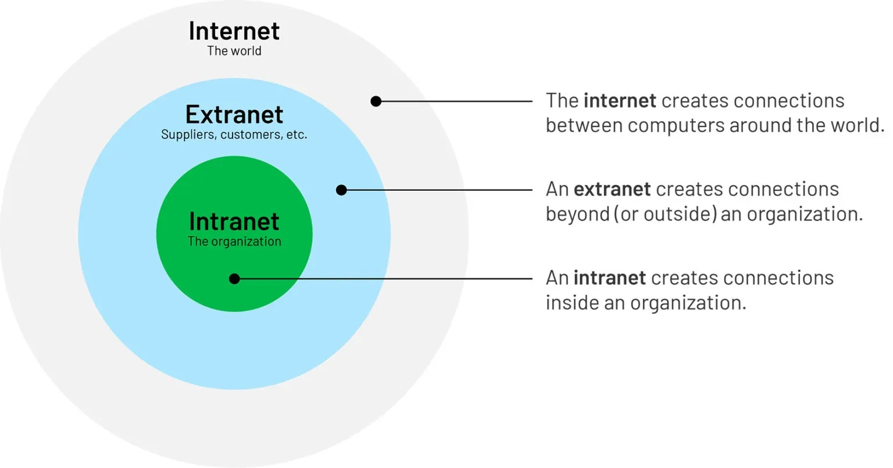

### Network Architecture

Computer Network Architecture is defined as the physical and logical design of the software, hardware, protocols, and media of the transmission of data. Simply we can say that how computers are organized and how tasks are allocated to the computer.

The two types of network architectures are used:

- Peer-To-Peer network
- Client/Server network

**Peer to Peer Network Architecture**

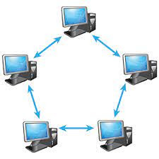

Peer-To-Peer network links all computers together with equal privilege processing. Peer-To-Peer network is mostly useful for small environments, usually up to 10 computers. Peer-To-Peer network do not have centralized server.

Advantages

- It is inexpensive.
- No other computers are affected if any one gets harm.
- Easy to setup and manage.

Disadvantages

- No Backup
- A big security issue

**Client Server Network Architecture**

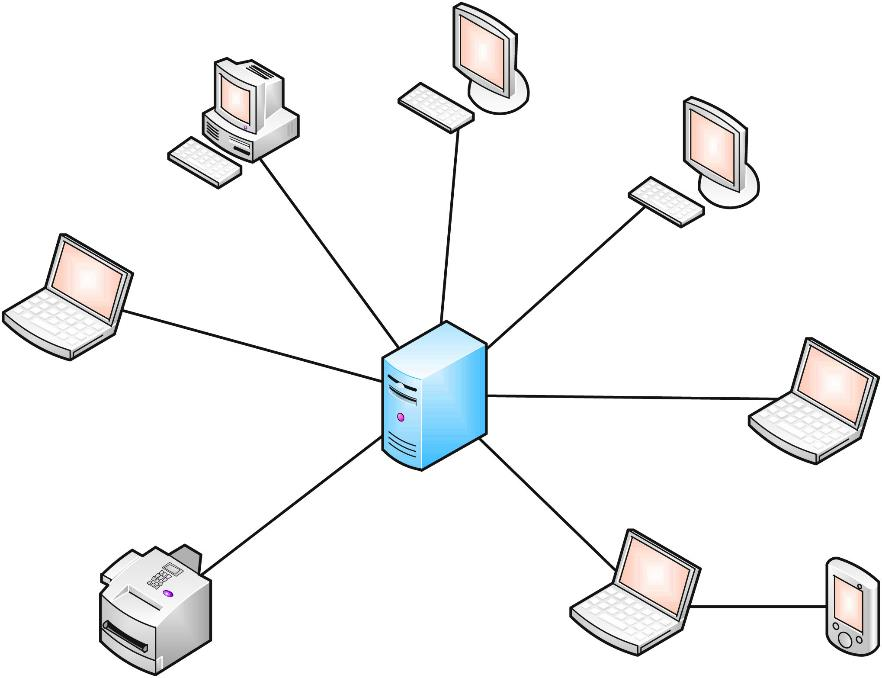

Client/Server network is a network model where client computer try to access the resources from a central computer known as Server. Request from clients are resolve with a response from the server. Computer that resolve the request is called server while the computer that request for data is called client.

**Advantage**

- Processing of data is done on the centralized server which
- improves network performance.
- Better Security
- Easy backup

**Disadvantages**

- Expensive since it required large processing & memory capability.
- NOS cost is high.
- Requires a dedicated network administrator.

### TCP / IP

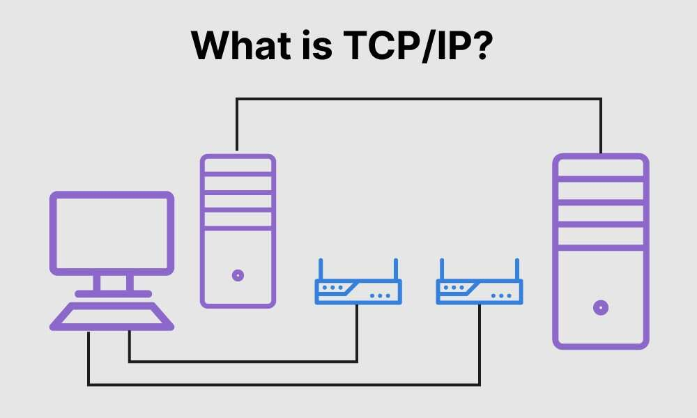

- TCP stands for Transmission Control Protocol, deals with ensuring that the data packets are delivered in a reliable manner from one computer to another. You could say that TCP sits on top of IP.
- IP stands for the Internet Protocol that deals with routing packets of data from one computer to another or from one router to another.

**Four Layers of TCP/IP**

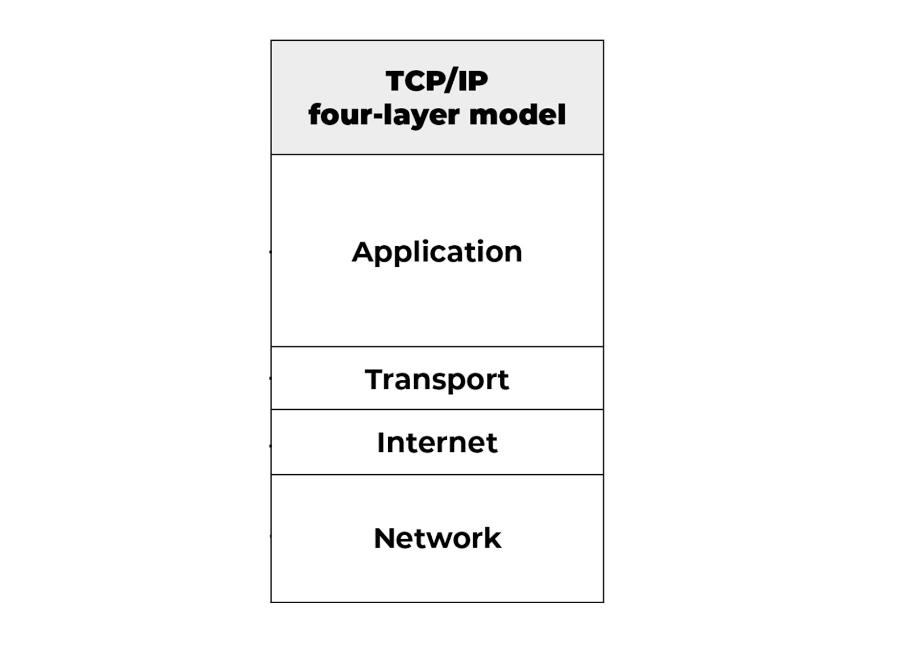

- The **application layer** provides applications with standardized data exchange. Its protocols include HTTP, FTP, Post Office Protocol 3, Simple Mail Transfer Protocol and Simple Network Management Protocol.
- The **transport layer** is responsible for maintaining end-to-end communications across the network. TCP handles communications between hosts and provides flow control, multiplexing and reliability.
- The **network layer**, also called the internet layer, deals with packets and connects independent networks to transport the packets across network boundaries.
- The **physical layer**, also known as the network interface layer or data link layer, consists of protocols that operate only on a link the network component that interconnects nodes or hosts in the network

**Vulnerabilities Of TCP/IP**

- Transfers are done in plain text
- Weak authentication between client and web server
- No solution to syn packet flooding
- IP layer susceptible to many vulnerabilities due to IP spoofing attacks

**Features Of Internet**

Services like email are used for communication and news for information, other services such as FTP and peer to-peer systems, are used mainly for exchanging different types of files through the Internet—a practice that is now an essential part of electronic communications.

- Email (Eg. Gmail)
- File Downloading using FTP Client (Eg. Filezilla)
- News (Eg. Google News)
- Internet Relay Chat (E.g Chatzilla)
- Web Based Chat (E.g Facebook)
- & many more

**Connecting To Internet**

As more businesses and people join the Internet community, they are finding that the Internet is enhancing their work lives. Before can do anything online, however, you must connect your PC to the Internet. There are several ways to do this.

- Dial-up Connections – using a modem with phone line
- High-Speed Broadband – multiple device at once
- Connections
- Integrated Services Digital Network (ISDN – Similar to Dial up but can connect multiple device at once
- Digital Subscriber Line (DSL) – same as ISDN but has larger signal processing and faster
- Satellite - Satellite services provide two-way data communications between the customer and the Internet

## Domain Name System and IP Address

### What is Domain Name System (DNS)?

All computers on the Internet, from your smart phone or laptop to the servers that serve content for massive retail websites, find and communicate with one another by using numbers. These numbers are known as IP addresses. Web browsers interact through Internet Protocol (IP) addresses. DNS translates domain names to IP addresses so browsers can load Internet resources.

Each device connected to the Internet has a unique IP address which other machines use to find the device.

### Components of DNS

**- DNS recursor / resolver:** The recursor can be thought of as a librarian who is asked to go find a particular book somewhere in a library. The DNS recursor is a server designed to receive queries from client machines through applications such as web browsers. Typically the recursor is then responsible for making additional requests in order to satisfy the client’s DNS query.

**- Root nameserver:** The root server is the first step in translating (resolving) human readable host names into IP addresses. It can be thought of like an index in a library that points to different racks of books - typically it serves as a reference to other more specific locations.

**- TLD nameserver** - The top level domain server (TLD) can be thought of as a specific rack of books in a library. This nameserver is the next step in the search for a specific IP address, and it hosts the last portion of a hostname (In example.com, the TLD server is `“com”`).

**- Authoritative nameserver** - This final nameserver can be thought of as a dictionary on a rack of books, in which a specific name can be translated into its definition. The authoritative nameserver is the last stop in the nameserver query. If the authoritative name server has access to the requested record, it will return the IP address for the requested hostname back to the DNS Recursor (the librarian) that made the initial request.

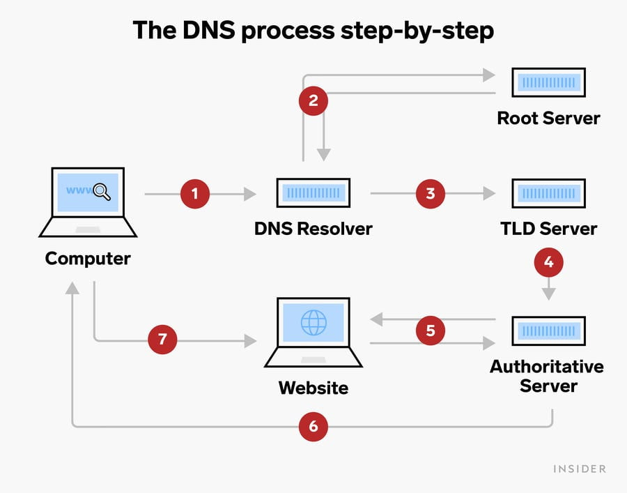

### What is a URL?

A URL (Uniform Resource Locator) is a unique identifier used to locate a resource on the Internet. It is also referred to as a web address. URLs consist of multiple parts -- including a protocol and domain name -- that tell a web browser how and where to retrieve a resource. The URL include following components

- **Protocol name:** A colon joined by a double forward-slash `//`.
- **Domain name:** It is generally called a Hostname or IP address.
- **Port number:** A colon is followed by the port number.
- The complete path of a resource, or file, or directory.

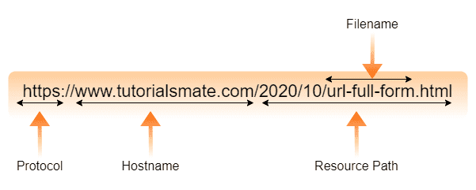

### Components of URL

- **Protocol** : It assists the browser in communicating with the server to send and retrieve data. Nowadays, most websites utilize hypertext transfer protocol secure (HTTPS), which is the same as Hypertext Transfer Protocol (HTTP). HTTPS is more secure and has features like data encryption. Apart from this, a website may use other protocols like POP, SMTP, FTP, etc.

- **Domain Name** : It is the name of the website present in the web address. A domain name acts as an identifiable part of the web address. If nothing is added to the end of the domain name, the user will be directed to the website’s homepage. It contains two other components; the first one is the name of the website and the second one is the Top-Level Domain (TLD). The TLD comes at the end of the domain name and it refers to .gov, .com, .info, .org, etc.

- **Port Number** : Port number is rarely visible in the URL. It comes after the TLD and is separated by a colon when it is declared in a URL. If not declared, port 80 is used for HTTP, and port 443 is used for HTTPS.

- **Path** : It is a way that directs a browser to a specific page of a website. It is also known as the URL slug. It is located at the last part of the web
  address.

- **Query:** The question mark (?) present in the URL after one or more parameters represents a query that directly follows the domain name and port number. Generally, it is found in dynamic pages (pages generated from the database or user).

- **Parameters:** They are the piece of information found in every query string of a URL. It follows a question mark and is separated by the
  ampersand (&) character.

- **Fragment:** It is an internal page reference that begins with a hash (#) character and appears at the end of a URL, followed by an identifier.

### Types Of URL

- **Absolute URL:** This type of URL contains both the domain name and directory/page path. An absolute URL gives complete location information. It begins with a protocol like “http://” and continues, including every detail. An absolute URL typically comes with the following syntax.
  `protocol://domain/path`

- **Relative URL:** This type of URL contains the path excluding the domain name. Relative means “in relation to”, and a relative URL tells a URL location on terms of the current location. Relative path is used for reference to a given link of a file that exist within the same domain.
  ``

- The dot(.) before the `/` means the location should be started from the current directory to find the file location.
