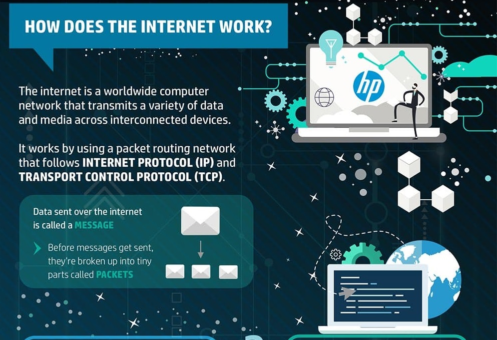
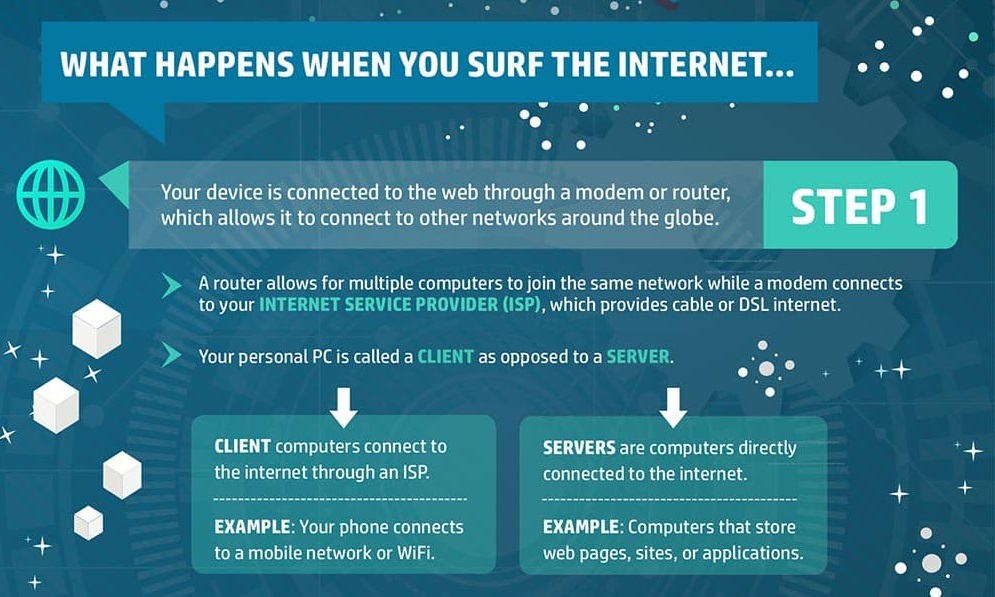
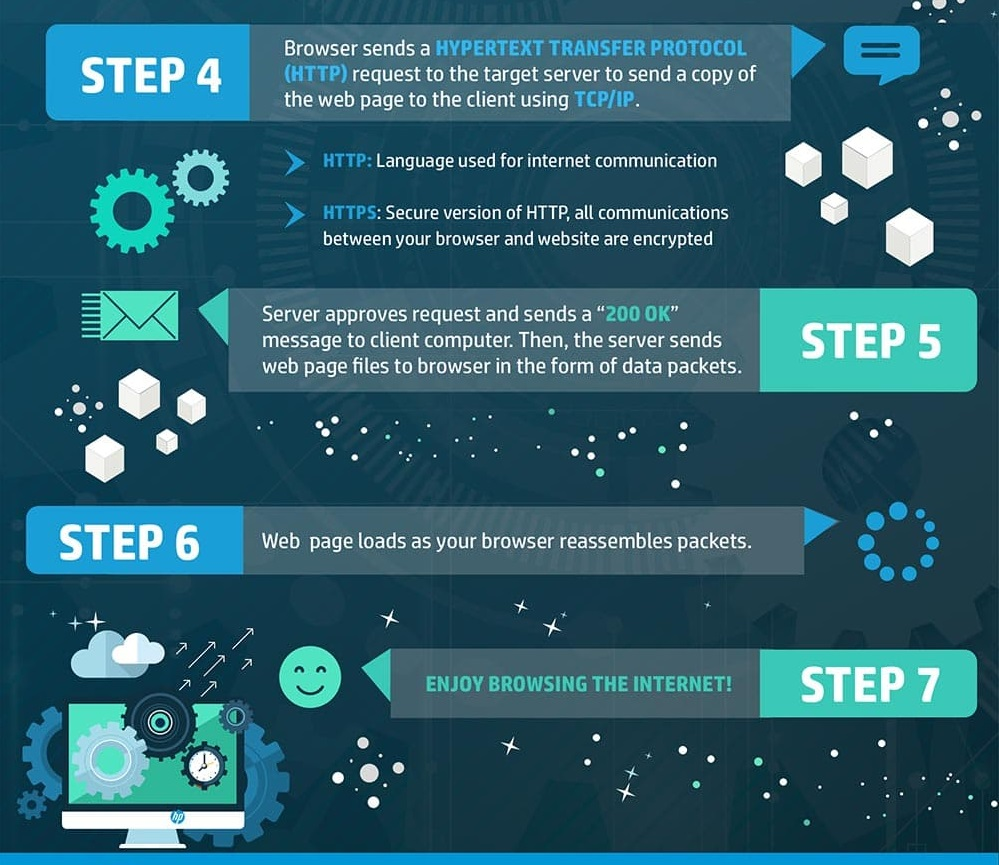
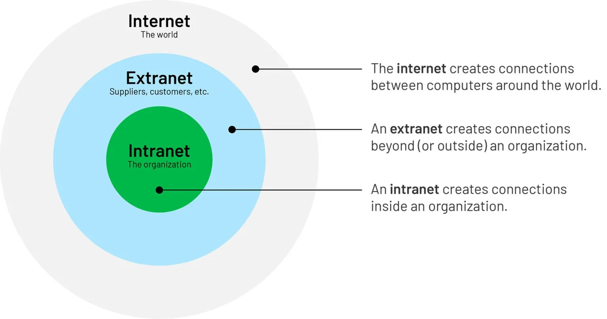
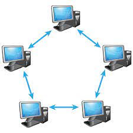
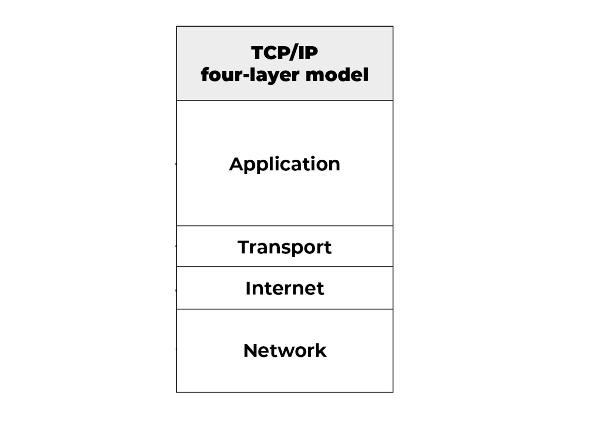
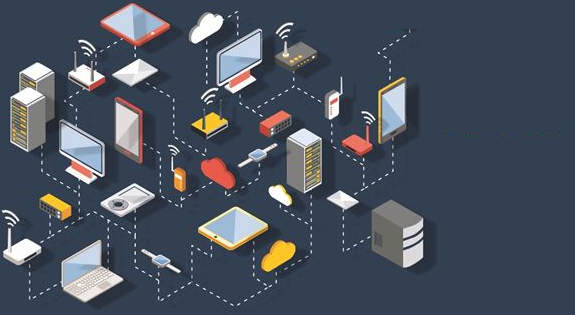

# Internet Fundamental and Applications

This is **Internet Fundamental and Applications**

## Internet And Its History

- In mid 60's ARPA in DOD was interested in finding a way to connect computers together just so, that researchers they funded could share their findings, thereby reducing costs and eliminating duplication of effort.
- In 1969 Four nodes at university of california at los angeles , university of california, stanford research institute and university of utah were connected.
- Arpa connected multiple other universities by the end but still it was not called internet, it was still a network.
- In 1972, Vint cerf and Bob Kahn both of whom were part of core ARPANET group collaborated in what they called Internetting project,
- They wanted to link different networks together so that one host network could communicate with second host in different network.
- They developed a gateway to connected multiple network. TCP IP was also introduced which became standard protocol to share data over internet.
- In 1981 CSNET was introduced by NSF. Only those who were tied up with DOD used Arpanet , CSNET allowed other universities to use internet.
- In 1983 ARPANET Splits to MILNET AND ARPANET.
- IN 1986 NSFNET was introduced as a successor of CSNET that connected 5 supercomputers centers located throughout US with speed of 1.544 Mbps.
- In 1990 ARPANET was dismantled because it was slow to use.
- In 1991 ANSNET was introduced by 3 different companies like IBM, Merit and MCI came together to form ANSNET as NSFNET was slow. ANSNET became commercial and many companies started using it.

### Network & Internet

- Network is simply just connecting computers to share resources.
- The global networks of network is called internet.

### How does internet work?

### Internet, Intranet & Extranet

**Internet**

The network formed by the co-operative interconnection of millions of computers, linked together is called Internet. Internet comprises of :

- People : People use and develop the network.
- Resources : A collection of resources that can be reached from those networks.
- A setup for collaboration : It includes the member of the research and educational committees worldwide.

**Intranet**

It is an internal private network built within an organization using Internet and World Wide Web standards and products that allows employees of an organization to gain access to corporate information. The main purpose of intranet is to share company information and computing resources among employees. Firewall is used to prohibit external users. Only authenticated users are allow to use the internet.

**Extranet**

It is a private network that uses internet technology and public telecommunication system to securely share part of business information or operation with suppliers, vendors, partners, customers or other business. It can be viewed as a company's intranet that is extended and accessible to users outside the company.

| Point of difference      | Internet                                                        | Intranet                                                                    | Extranet                                                                            |
| ------------------------ | --------------------------------------------------------------- | --------------------------------------------------------------------------- | ----------------------------------------------------------------------------------- |
| Accessibility of network | Public                                                          | Private                                                                     | Private                                                                             |
| Availability             | Global system.                                                  | Specific to an organization.                                                | To share information with suppliers and vendors it makes the use of public network. |
| Coverage                 | All over the world.                                             | Restricted area upto an organization.                                       | Restricted area upto an organization and some of its stakeholders or so.            |
| Accessibility of content | It is accessible to everyone connected.                         | It is accessible only to the members of organization.                       | Accessible only to the members of organization and external members with logins.    |
| Owner                    | No one.                                                         | Single organization.                                                        | Single/ Multiple organization.                                                      |
| Purpose of the network   | It’s purpose is to share information throughout the world.      | It’s purpose is to share information throughout the organization.           | It’s purpose is to share information between members and external, members.         |
| Security                 | It is dependent on the user of the device connected to network. | It is enforced via firewall.                                                | It is enforced via firewall that separates internet and extranet.                   |
| Users                    | General public.                                                 | Employees of the organization.                                              | Employees of the organization which are connected.                                  |
| Maintenance              | It is maintained by ISP.                                        | It is maintained by CIO. HR or communication department of an organization. | It is maintained by CIO. HR or communication department of an organization.         |
| Economical               | It is more economical to use.                                   | It is less economical.                                                      | It is also less economical.                                                         |

### Network Architecture

Computer Network Architecture is defined as the physical and logical design of the software, hardware, protocols, and media of the transmission of data. Simply we can say that how computers are organized and how tasks are allocated to the computer.

The two types of network architectures are used:

- Peer-To-Peer network
- Client/Server network

**Peer to Peer Network Architecture**

Peer-To-Peer network links all computers together with equal privilege processing. Peer-To-Peer network is mostly useful for small environments, usually up to 10 computers. Peer-To-Peer network do not have centralized server.

Advantages

- It is inexpensive.
- No other computers are affected if any one gets harm.
- Easy to setup and manage.

Disadvantages

- No Backup
- A big security issue

**Client Server Network Architecture**

Client/Server network is a network model where client computer try to access the resources from a central computer known as Server. Request from clients are resolve with a response from the server. Computer that resolve the request is called server while the computer that request for data is called client.

Advantage

- Processing of data is done on the centralized server which
- improves network performance.
- Better Security
- Easy backup

Disadvantages

- Expensive since it required large processing & memory capability.
- NOS cost is high.
- Requires a dedicated network administrator.

### TCP / IP

- TCP stands for Transmission Control Protocol, deals with ensuring that the data packets are delivered in a reliable manner from one computer to another. You could say that TCP sits on top of IP.
- IP stands for the Internet Protocol that deals with routing packets of data from one computer to another or from one router to another.

**Four Layers of TCP/IP**

- The **application layer** provides applications with standardized data exchange. Its protocols include HTTP, FTP, Post Office Protocol 3, Simple Mail Transfer Protocol and Simple Network Management Protocol.
- The **transport layer** is responsible for maintaining end-to-end communications across the network. TCP handles communications between hosts and provides flow control, multiplexing and reliability.
- The **network layer**, also called the internet layer, deals with packets and connects independent networks to transport the packets across network boundaries.
- The **physical layer**, also known as the network interface layer or data link layer, consists of protocols that operate only on a link the network component that interconnects nodes or hosts in the network

**Vulnerabilities Of TCP/IP**

- Transfers are done in plain text
- Weak authentication between client and web server
- No solution to syn packet flooding
- IP layer susceptible to many vulnerabilities due to IP spoofing attacks
